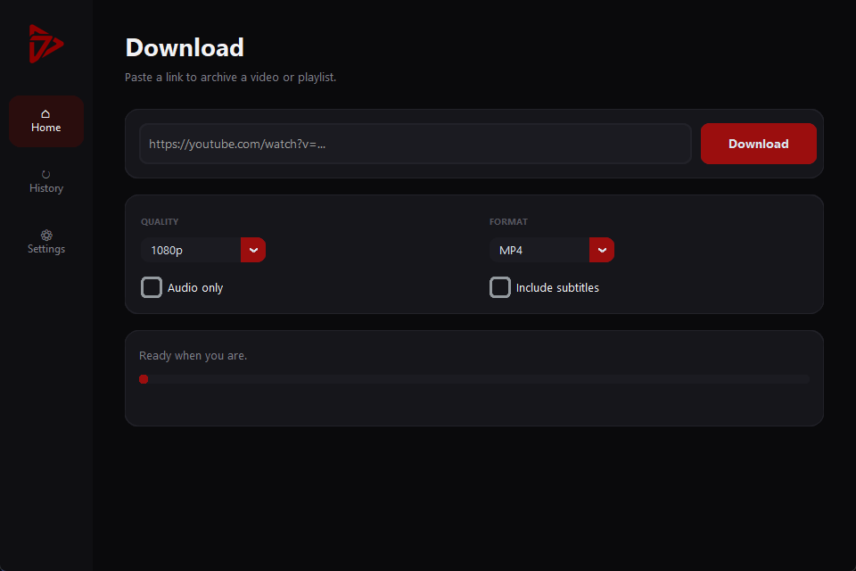

<div align="center">


# YT7th

**A clean, dark-themed desktop app for archiving your own YouTube videos and playlists.**

Built with Python, yt-dlp, and customtkinter.

[](https://github.com/SeventhSG/YT7th/releases)
[](LICENSE)
[](https://github.com/SeventhSG/YT7th/releases)
[](https://www.python.org/)
[](https://github.com/yt-dlp/yt-dlp)
[](https://github.com/SeventhSG/YT7th/releases)



</div>

---

## Table of contents

- [Intended use](#intended-use)
- [Features](#features)
- [Download (Windows & macOS)](#download-windows--macos)
- [Requirements](#requirements)
- [Install from source](#install-from-source)
- [How to use](#how-to-use)
- [Authentication (member-only and private videos)](#authentication-member-only-and-private-videos)
- [Build a standalone app](#build-a-standalone-app)
- [Project layout](#project-layout)
- [Troubleshooting](#troubleshooting)
- [FAQ](#faq)
- [Credits](#credits)
- [License](#license)

## Intended use

YT7th is for **personal archival only** - saving videos for your own offline use. It is **not** intended or promoted for redistribution, piracy, or any use that violates YouTube's Terms of Service. Please respect YouTube's rules and the rights of content creators. You are responsible for how you use this tool.

## Features

- **Quality and format selection at download time** - from 360p up to 4K, or "Best" for whatever the video offers
- **Single videos and full playlists**
- **Audio-only extraction** to MP3 or M4A
- **Subtitle / caption download**
- **Download history** with one-click "open folder"
- **Cancel** a download mid-flight
- **Smart authentication** - public videos download with zero login data sent; your cookies are used only when a video is actually gated (member-only, private, age-restricted), and only after a normal attempt fails
- **Friendly error messages** - plain language instead of raw stack traces
- **Dark modern UI** with a left sidebar and dark red accent
- **Low disk space guard** - warns before a merge would fail
- **In-app update notifier** - tells you when a newer release is out
- **Packaged for Windows and macOS** with **FFmpeg and a JS runtime bundled** - the prebuilt apps run on a clean machine, nothing else to install

## Download (Windows & macOS)

Grab the latest build from the [Releases page](https://github.com/SeventhSG/YT7th/releases). FFmpeg and a JavaScript runtime are **bundled** in the prebuilt apps - no separate install needed.

### Windows

1. Download `YT7th-windows.zip`
2. Extract the folder anywhere
3. Run `YT7th.exe`

### macOS (Apple Silicon)

1. Download `YT7th-macos.zip`
2. Unzip and move `YT7th.app` to **Applications**
3. The app is **unsigned**, so the first launch is blocked by Gatekeeper. **Right-click the app -> Open -> Open**, or run `xattr -cr /Applications/YT7th.app` once in Terminal. After that it launches normally.

> The macOS build is arm64 and runs natively on Apple Silicon Macs (M1 and newer). The bundled FFmpeg may use Rosetta 2 for the merge/convert step; if a merge fails on a fresh machine, install it once with `softwareupdate --install-rosetta --agree-to-license`. Intel Macs are not currently supported by the prebuilt app (build from source instead).

## Requirements

| Requirement | Why | Get it |
|---|---|---|
| **Python 3.11+** | Running from source | [python.org](https://www.python.org/) |
| **FFmpeg** (on PATH) | Merges video + audio, extracts audio | [ffmpeg.org](https://ffmpeg.org/) |
| **A JavaScript runtime** (on PATH) | YouTube requires solving a JS challenge to release video streams | [Node.js 22+](https://nodejs.org/) (recommended), [Deno](https://deno.com/), or Bun |

> These apply only when **running from source**. The prebuilt Windows and macOS downloads bundle FFmpeg and Deno already.

> **Why a JavaScript runtime?** YouTube serves real video streams only after a JavaScript "signature / n" challenge is solved. Without a runtime installed, only image storyboards are available and every download fails with "Requested format is not available". The EJS solver scripts that drive this ship with `yt-dlp[default]`, already pinned in `requirements.txt`. YT7th auto-detects whichever runtime is on your PATH.

Verify your setup:

```bash
ffmpeg -version
node --version   # or: deno --version
```

## Install from source

```bash
git clone https://github.com/SeventhSG/YT7th.git
cd YT7th
pip install -r requirements.txt
python main.py
```

## How to use

1. **Paste a link** - a single video or a full playlist URL
2. **Pick quality and format** - or tick **Audio only** for MP3 / M4A
3. Optionally tick **Include subtitles**
4. Click **Download**
5. Watch progress (percentage, speed, ETA). Hit **Cancel** any time
6. Find past downloads under **History**, with a button to open each file's folder

Set your download folder under **Settings**.

## Authentication (member-only and private videos)

To archive content you have access to, give YT7th your login cookies. Everything stays local; nothing is uploaded anywhere. YT7th only uses these when a video actually needs them, so normal public downloads never carry your login data.

Open **Settings** and choose one of:

### 1. Cookies file (recommended)

1. Install a browser extension such as **"Get cookies.txt LOCALLY"**
2. Log into YouTube, then export a `cookies.txt`
3. In YT7th: Settings -> **Choose file** and select it

Works even while the browser is open, and is immune to Chromium app-bound cookie encryption.

### 2. Read from browser

Pick the browser you are logged into. On Windows you must **close the browser completely first** (it locks its cookie database while running). On Chrome / Brave v127+ this can also fail due to app-bound encryption, so the cookies file method is more reliable.

## Build a standalone app

```bash
pip install pyinstaller
pyinstaller build.spec
```

On Windows the packaged app appears in `dist/YT7th/`; on macOS you get `dist/YT7th.app`. The build bundles yt-dlp, the EJS solver scripts, and customtkinter assets.

To bundle FFmpeg and Deno into the app (so it runs on a clean machine), drop the matching executables into a top-level `bin/` directory before building - `ffmpeg`, `ffprobe`, `deno` (add `.exe` on Windows). This is exactly what the GitHub Actions release workflow (`.github/workflows/release.yml`) does automatically for both platforms; pushing a `vX.Y.Z` tag builds and publishes both downloads.

## Project layout

```
YT7th/
  main.py            entry point
  downloader.py      yt-dlp engine, JS runtime detection, smart auth, friendly errors
  auth.py            cookie handling (file + browser) and browser-running guard
  data.py            settings (JSON) + history (SQLite)
  list_formats.py    diagnostic: list the formats yt-dlp sees for a URL
  ui/
    app.py           main window + sidebar
    theme.py         design tokens (colors, fonts, type scale)
    home.py          download view
    history.py       history view
    settings.py      settings view + credit footer
    messages.py      playful in-app copy
  assets/            logo (svg, png, ico) + screenshot
  build.spec         PyInstaller config
  requirements.txt
```

## Troubleshooting

| Symptom | Cause and fix |
|---|---|
| **"Requested format is not available"** / only images download | No JavaScript runtime found. Install [Node.js 22+](https://nodejs.org/), Deno, or Bun and make sure it is on your PATH. |
| **"Could not read your browser cookies"** | The browser is running and locks its cookie database. Close it fully, or use the cookies.txt file method. |
| **Merge or conversion fails** | FFmpeg missing from PATH, or low disk space. Install FFmpeg and free up room. |
| **"This is a members-only video"** | Add your account cookies in Settings, then retry. |
| **Nothing happens / instant error on a valid link** | Run the diagnostic: `python list_formats.py <url>` to see exactly what yt-dlp sees. |

## FAQ

**Does YT7th send my cookies for every download?**
No. It tries each download without any login data first, and only retries with your cookies if the video turns out to be gated.

**Where are my settings and history stored?**
`settings.json` and `history.db` live in a per-user app-data folder: `%APPDATA%\YT7th` on Windows, `~/Library/Application Support/YT7th` on macOS. They are never committed or uploaded.

**Can it download a whole playlist?**
Yes. Paste the playlist URL and it processes every entry.

**Why is the .exe bundle large?**
It packs Python, yt-dlp, the EJS scripts, and the UI toolkit so it runs without a Python install.

## Credits

Developed by [SeventhSG](https://github.com/SeventhSG).

Powered by [yt-dlp](https://github.com/yt-dlp/yt-dlp) and [customtkinter](https://github.com/TomSchimansky/CustomTkinter).

## License

MIT. See [LICENSE](LICENSE).
